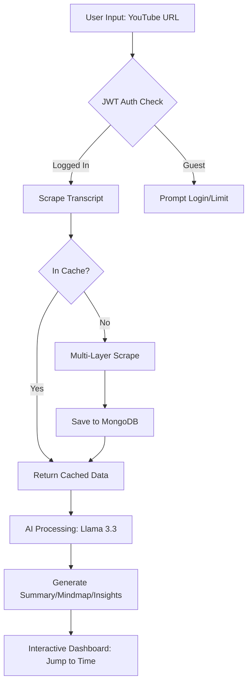

# 🚀 Unified Transcript AI: The Ultimate YouTube Intelligence Dashboard


**Unified Transcript AI** is a professional-grade SaaS platform that transforms any YouTube video into actionable intelligence. By combining advanced web scraping with Meta's **Llama 3.3 (70B)** AI, this tool provides instant transcription, interactive syncing, and deep cognitive analysis in seconds.

---

## ✨ Key Features 

### 🔄 System Workflow


### 🔍 Precision Transcription
*   **Instant Extraction**: Scrape full transcripts from any YouTube video for free.
*   **Multi-Layer Scraping**: Advanced fallback logic (TimedText API + player scraping) ensures high success rates even for restricted videos.
*   **SRV3 Support**: Built-in support for multiple caption formats.

### 🧠 AI Cognitive Suite (Powered by Llama 3.3)
*   **Dynamic Summaries**: Condense hours of video content into high-impact bullet points.
*   **Deep Insights**: Automatically identify key takeaways and critical data points.
*   **Hierarchical Mindmaps**: Transform speech into structured, logical outlines.
*   **Global Translation**: Instant translation into 5+ languages with nuanced tone preservation.

### 🎬 Professional UX/UI
*   **Timestamp Sync**: Click any transcript segment to jump the video instantly without page reloads.
*   **Glassmorphic Design**: A premium, dark-mode interface built for modern aesthetics.
*   **Live Sync Indicator**: Visual feedback showing the exact sync status between video and text.

### 🔐 Enterprise-Grade Security
*   **JWT Auth**: Secure JSON Web Token-based login and registration.
*   **Bcrypt Encryption**: Industry-standard password hashing for user protection.
*   **Session Persistence**: Stay logged in across refreshes with secure local storage management.

---

## 🛠 Project Tech Stack

### Frontend
- **Framework**: Next.js 16 (App Router)
- **Styling**: Tailwind CSS 4.0
- **Animation**: Framer Motion
- **Icons**: Lucide React
- **API Client**: Axios

### Backend
- **Framework**: FastAPI (Python 3.12)
- **AI Engine**: Groq (Meta Llama-3.3-70b-versatile)
- **Scraper**: Custom HTTP Session logic (Requests + BeautifulSoup)
- **Authentication**: Python-Jose (JWT) + Passlib (Bcrypt)

### Database
- **Engine**: MongoDB Atlas (Cloud Hosted)
- **Driver**: Motor (Asynchronous Driver)

---

## 📂 Project Structure

```text
.
├── backend/                # FastAPI Application
│   ├── api/                # Route Controllers (Auth, Routes)
│   ├── services/           # Logic (AI Service, Transcription Service)
│   ├── utils/              # DB Helpers (MongoDB, Auth Utils)
│   ├── Procfile            # Deployment command for Render
│   └── requirements.txt    # Python Dependencies
├── frontend/               # Next.js Application
│   ├── app/                # Main dashboard & Layout
│   ├── components/         # Modular UI Components
│   └── next.config.ts      # Deployment Config
├── README.md               # Primary Overview
├── PROJECT_INFO.md         # Deep-dive tech documentation
└── DEPLOYMENT.md           # Production guides
```

---

## ⚙️ Local Development Setup

### 1. Clone & Env Setup
```bash
git clone <your-repo-url>
cd unified-transcript-ai
```

### 2. Backend Initialization
```bash
cd backend
python -m venv venv
source venv/bin/activate  # On Windows: venv\Scripts\activate
pip install -r requirements.txt
```
**Configure `backend/.env`**:
```env
GROQ_API_KEY=your_key
MONGODB_URI=your_atlas_url
AUTH_SECRET=your_random_secret
```

### 3. Frontend Initialization
```bash
cd frontend
npm install
npm run dev
```

---

## 🌐 Deployment Roadmap

This project is optimized for a dual-cloud deployment:

| Layer | Recommended Host | Step |
| :--- | :--- | :--- |
| **Frontend** | **Vercel** | Link your repo and it will auto-detect the root `vercel.json`. |
| **Backend** | **Render** | Use the existing `Procfile`. Set the Environment to `Python`. |
| **Database** | **Atlas** | Set your IP whitelist to `0.0.0.0` for global access. |

---

## 🤝 Contributing & Support

This project was built for speed and intelligence. If you encounter any issues:
1. Check the `DEPLOYMENT.md` for common CORS/Auth errors.
2. Verify your **Groq API** quota (Llama 3.3 requires an active account).

© 2026 Unified Transcript AI. **Engineered for the Modern Web.**
